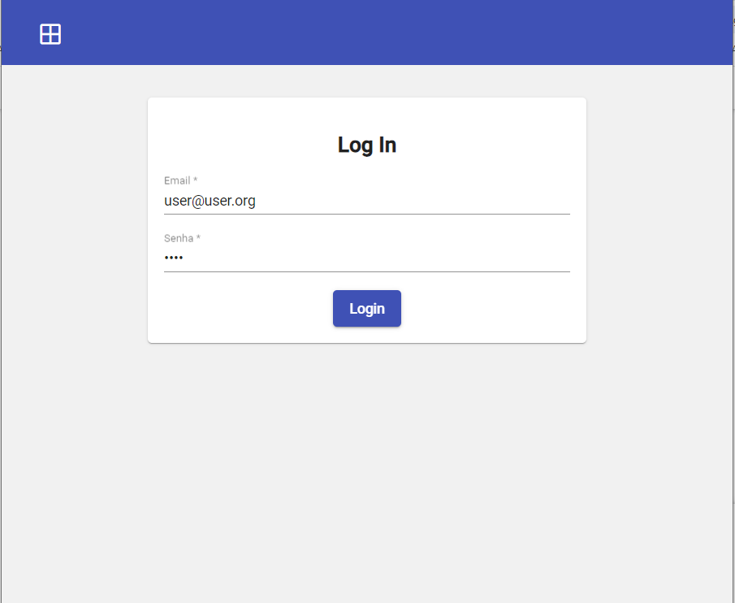
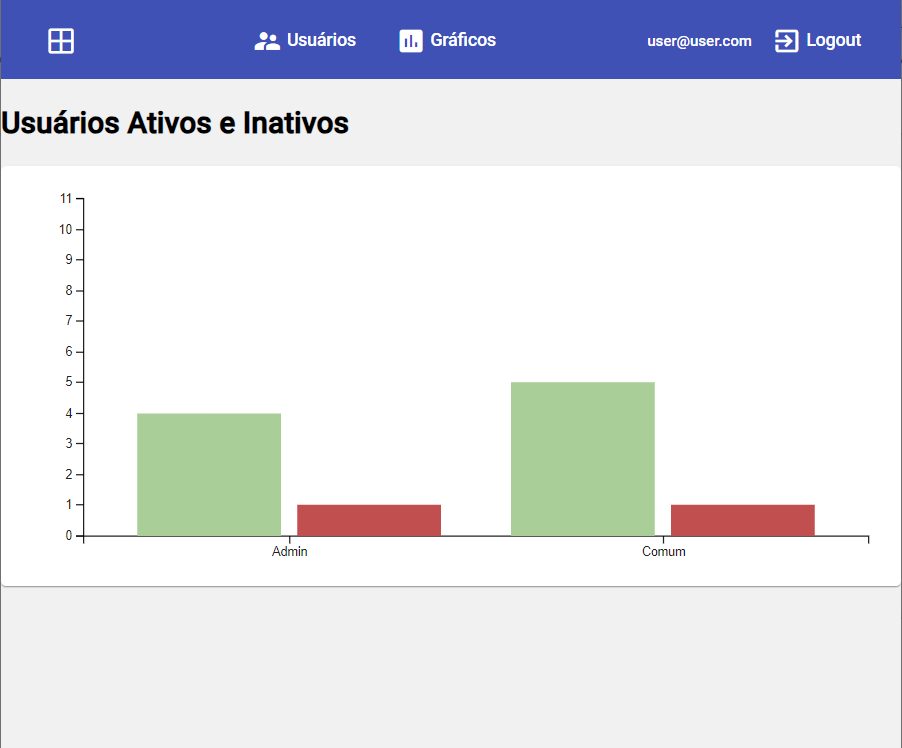
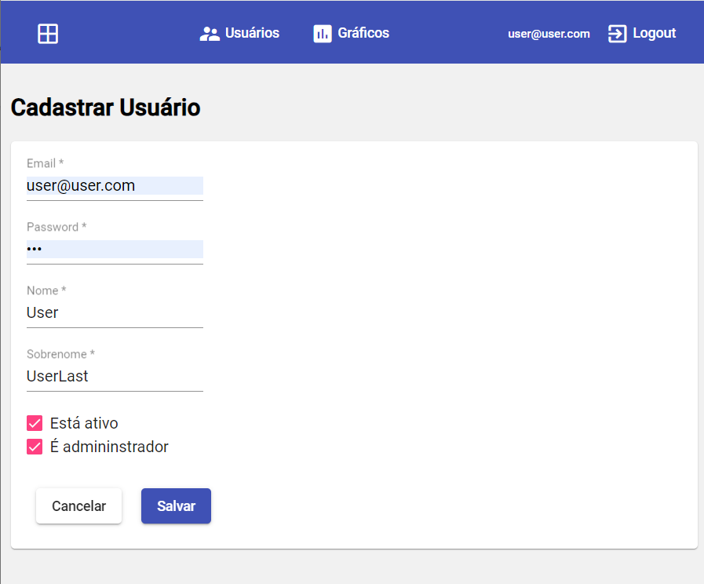

# BasicFrontend

Se trata de um sistema de gerenciamento de usuários. Possui um gráfico quantitativo de usuários ativos e cancelados separados por perfil de usuário ADMIN ou COMUM.

O sistema foi desenvolvido usando python e angular

Abaixo telas do sistema


## 💻 Pré-requisitos

Antes de começar, verifique se você atendeu aos seguintes requisitos:

- Docker
- Docker Compose


## 🚀 Instalando

Para instalar é necessário possuir docker e docker compose instalados :

Após execute o seguinte comando:

```
docker compose up -d
```

### Itens instalados:

Na execução do comando `docker compose up -d` o sistema cria alguns componentes e um usuário admin. Veja a relação a seguir:

- Postgres : Executando por padrão na porta `5438` 
    user: `postgres` senha: `password132`
- Backend:  : Executando por padrão na porta `8009`
- Frontend:  : Executando por padrão na porta `80`

Caso tenha algum conflito de porta basta editar no arquivo `docker-compose.yml`


Ao iniciar o sistema cria toda a base de dados e um usuário Admin:

email: `indt@indt.org` 
password: `indt` 


## ☕ Usando 

Para usar , siga estas etapas:
Execute no terminal o seguinte comando

```
npm start
```

O sistema poderá ser acesso no seguinte endereço pelo browser: `http://localhost/`


## Tela de Login
Para autenticar use:

email: `indt@indt.org` 
password: `indt` 




## Gráfico Quantitativo de Usuários

Abre como tela inicial após o login:



## Lista de Usuário

Para acessar clique em Usuários:

Apartir dessa tela você pode criar , excluir ou editar usuários


## Cadastro/Edição de Usuário



## ☕ Ambiente de desenvolvimento


Para mais informações sobre ambiente de desenvolvimento veja:


[Documentação Frontend](basic_frontend/README.md).

[Documentação Backend](basic_backend/README-API.md).

[Documentação Backend API](basic_backend/README-API.md).
