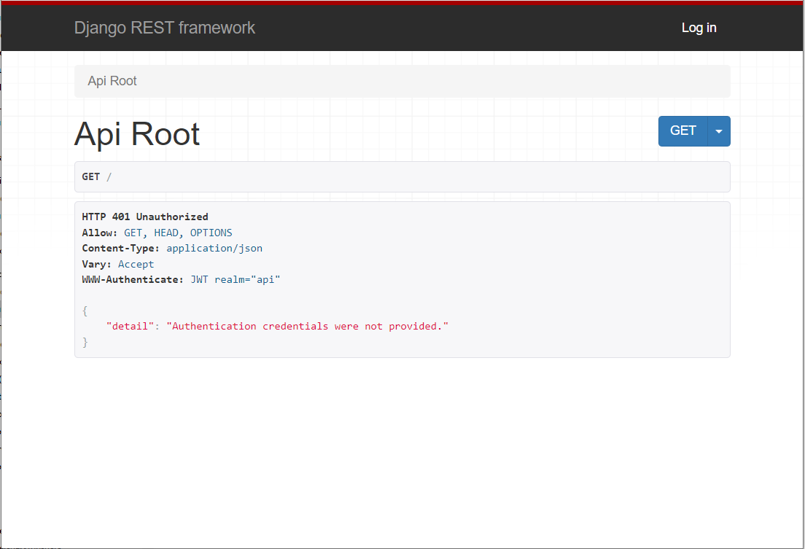
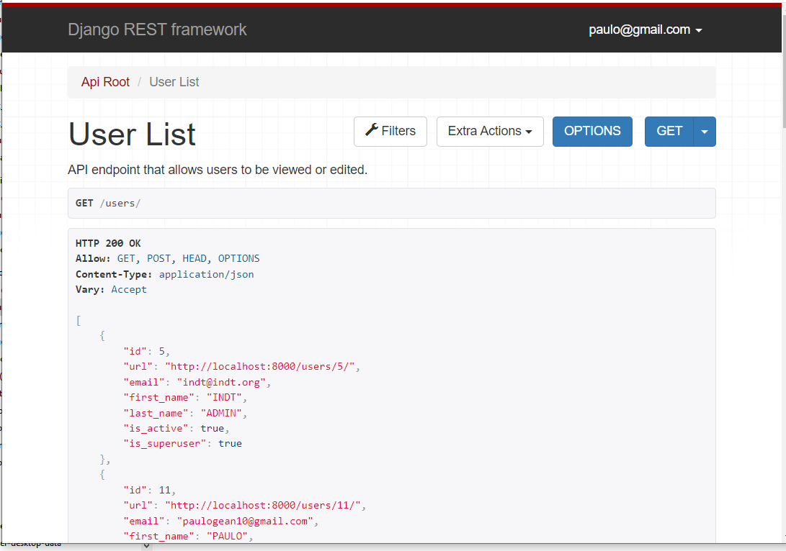

# BasicBackend

Se trata de um app front backend com crud de usuário , desenvolvido com python e django.
O sistema usa autenticação jwt

## 💻 Pré-requisitos

Antes de começar, verifique se você atendeu aos seguintes requisitos:

- Python 3 ou superior
- Postgres


## 🚀 Instalando


Para instalar é necessário possuir python , siga estas etapas:

OBS: Você pode criar um ambiente virtual.  
Segue um link explicando: 

[Guia Completo para Usar o Virtual Environment (venv) no Python](https://dev.to/franciscojdsjr/guia-completo-para-usar-o-virtual-environment-venv-no-python-57bo).


Após python está instalado no computador primeiramente instale as dependencias com o seguinte comando:


```
pip install -r requirements.txt
```

## ☕ Usando 

Para usar , siga estas etapas:
Primeiramente é necessário o banco de dados ser criado, estamos usando postgres:
No arquivo : `basic_backend/app.conf` há propriedades de conexão com banco. Por padrão está de um postgress executádo via docker que está no projeto.
Caso necessário pode ser modificado para ambiente de desenvolvimento

Base do projeto que deve ser criada no postgres caso não use o docker: `basic_db` 

```
basic_db
```


Com a base de dados criada e o arquivo `basic_backend/app.conf` corretamente parametrizado, execute no terminal o seguinte comando

```
python manage.py migrate
```

Para criar um usuário para acesso a api:

```
python manage.py createsuperuser
```


Após possuir um usuário. Execute no terminal o seguinte comando

```
python manage.py runserver
```

O sistema poderá ser acesso no seguinte endereço pelo browser: `http://localhost:8000/`


## 🚀 DJango

O Django possui uma interface que facilita muito teste da api.

Abaixo telas da api criada:

Acessando o endereço: 
`http://localhost:8000/`
## Tela inicial não autenticada


Clique em Log In, e use o usuário criado anteriormente:

Você verá a seguinte tela: 

`http://localhost:8000/users`

## Api Users


## Documentação API

Para vizualizar o contrato e mais informações da api veja o REAME a seguir:

[Documentação API](README-API.md).


